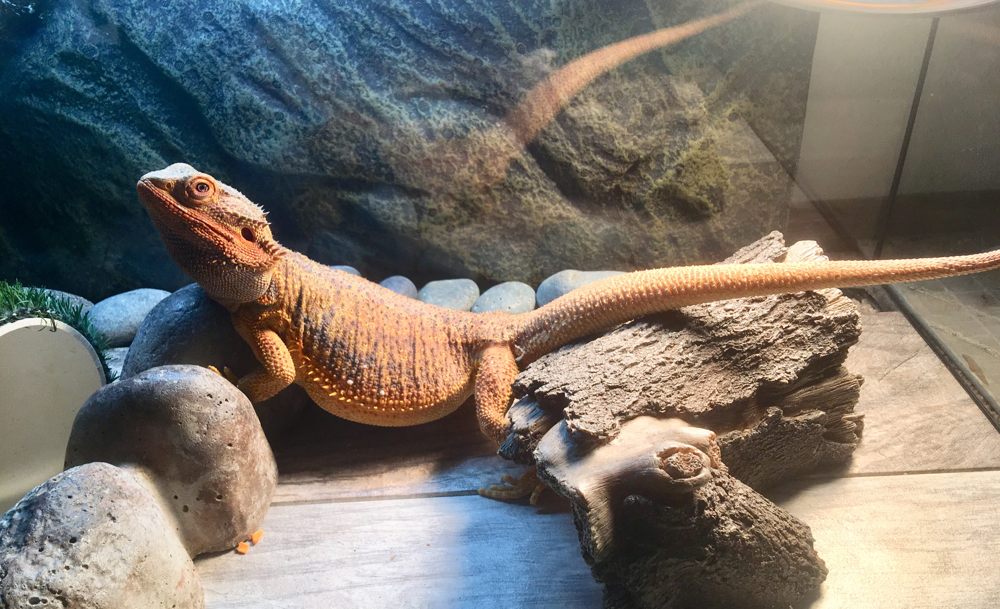
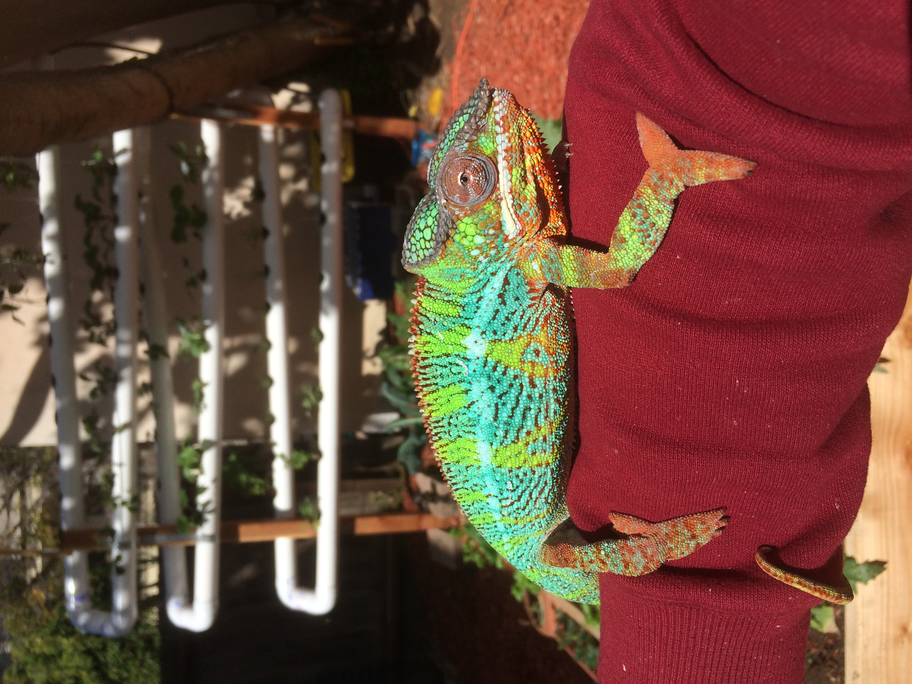
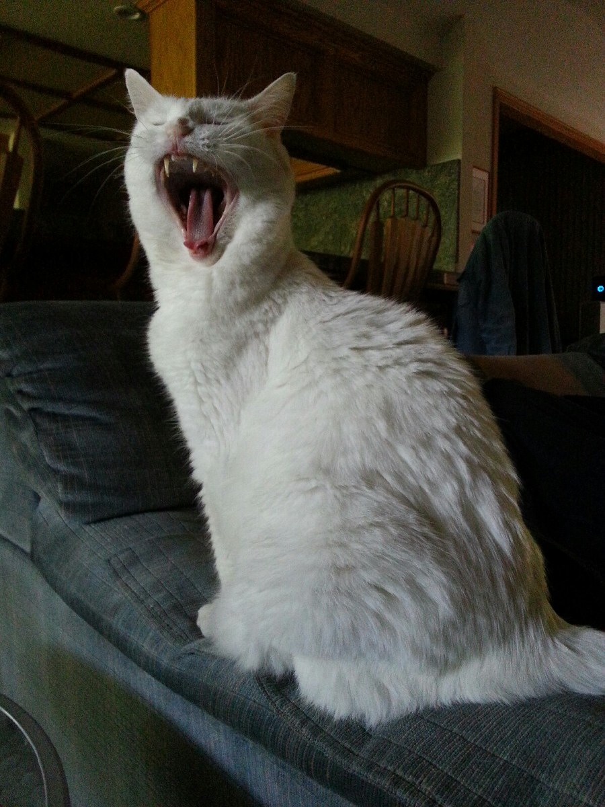

This Convolutional Neural Network is trained on images of a bearded dragon and various cats. An example of each is shown below.

 .crop img {
  width: 400px;
  height: 300px;
  margin: -75px 0 0 -100px;
}

  
  
  
 

The success rate is: xxx.
