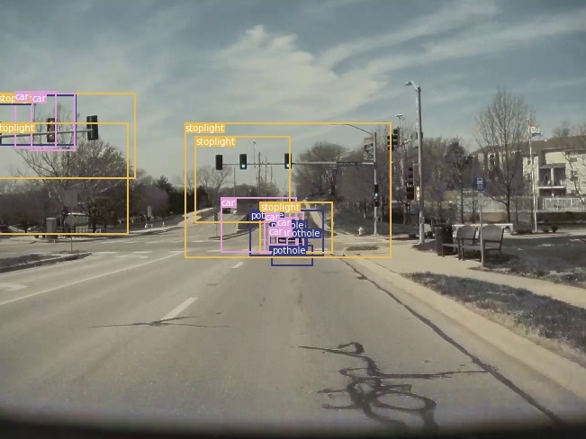
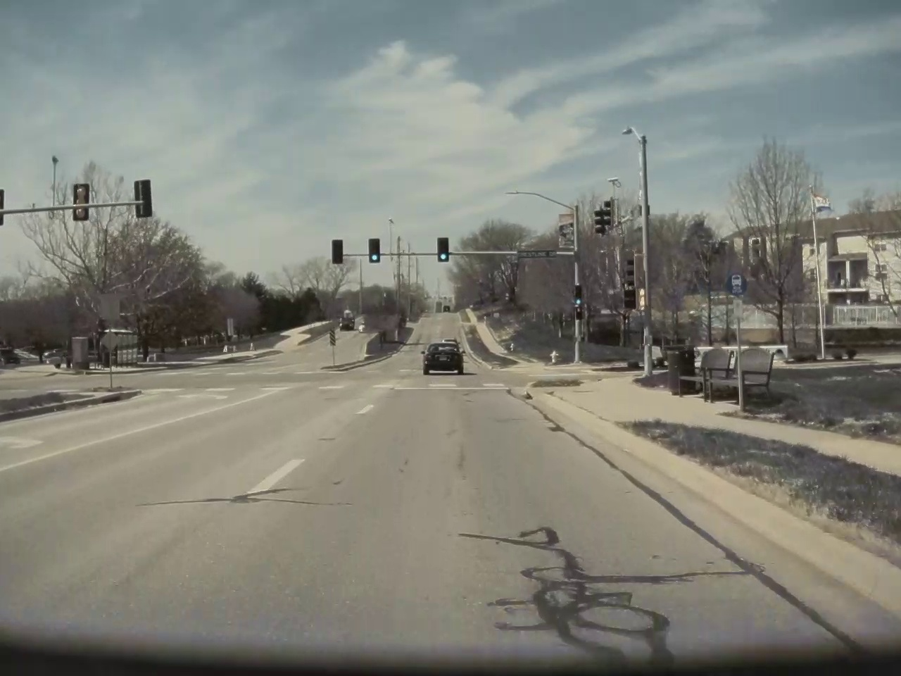

 # Object Detection Project

Project code for Object Detection with PyTorch done with footage from TeslaCam.

This projct works through 3 classifications of common objects on the road: stoplights, cars, and potholes. The Tesla 2020.12* software already includes cars, cones, stoplights/signs, humans, bikes, and road markings, but not potholes. A final product (in progress) can be seen below. 

 

## Prerequisites
The Code is written in Python 3.6.5 . If you don't have Python installed you can find it [here](https://www.python.org/downloads/). If you are using a lower version of Python you can upgrade using the pip package, ensuring you have the latest version of pip. 

To install pip run in the command Line
```
python -m ensurepip -- default-pip 
``` 
to upgrade it
```
python -m pip install -- upgrade pip setuptools wheel
```
to upgrade Python
```
pip install python -- upgrade
```
Additional Packages that are required are: [Numpy](http://www.numpy.org/), [Pandas](https://pandas.pydata.org/), [MatplotLib](https://matplotlib.org/), [Pytorch](https://pytorch.org/), PIL and json.\
You can donwload them using [pip](https://pypi.org/project/pip/)
```
pip install numpy pandas matplotlib pil
```
or [conda](https://anaconda.org/anaconda/python)
```
conda install numpy pandas matplotlib pil
```
In order to install PyTorch head over to the PyTorch site select your specs and follow the instructions given.	

### Project assets:

- `Pothole_finder_OD.ipynb` is the notebook containing relevant code. 
- `tesla_dashcam.data` is a config file.
- `tesla_dashcam.names` which are the 3 classes of objects (stoplight, car, potholes) that I am detecting in images.
- `extract_video.py` takes TeslaCam footage and extracts out the frames in .jpg.
- `bbox.py` is a Python GUI to define objects and write their coordinates to a file. 


Directory should contain directories **images** and **labels**, which are .JPG files of the images and a single text file per image stating the class, x/y coordinates and width/height of object in that specific image. bbox.py automatically creates these files. Train.txt and val.txt point to which images are to be used for training and validation.

## Viewing the Jupyter Notebook

Open terminal in current folder where the notebook is and type:
```
jupyter notebook
```


## Prediction
* This project is in progress. My first iteration was successful (to some extent) but I need to redo some of the object classifications with bbox.py. Right now, it is overdetecting because my bounding boxes are too large. 

## To Do: 

- [x] Train on 3 custom classes 
- [x] Complete Notebook for Object Detection with examples displayed
- [ ] Complete with Tracking using full video files  

